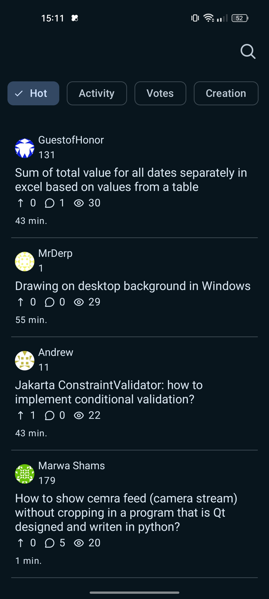
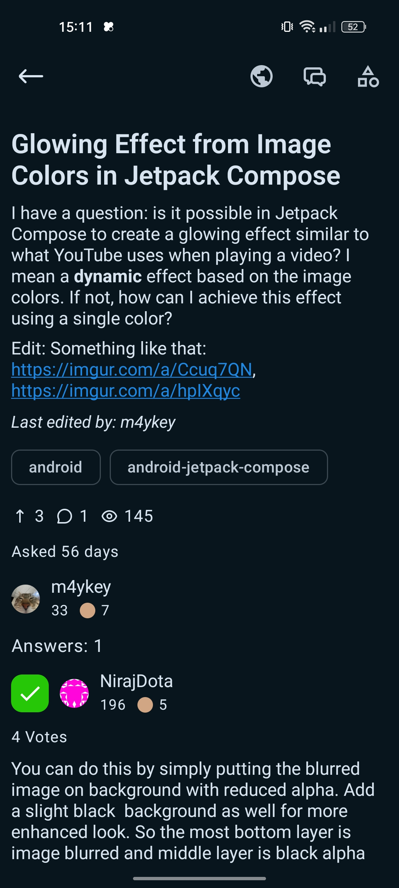
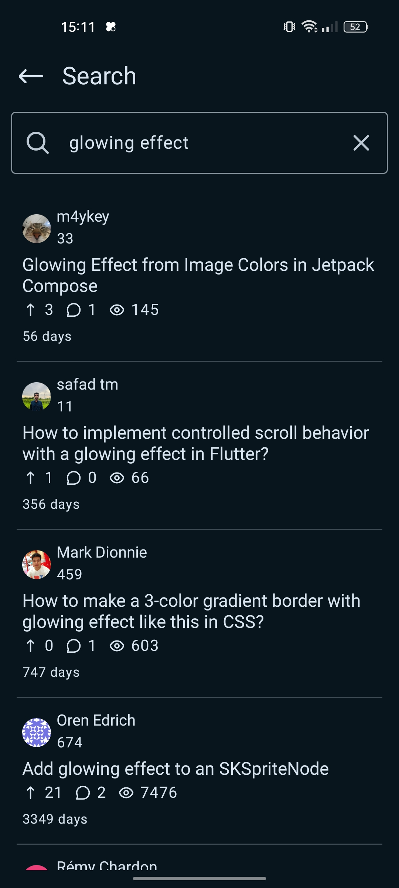
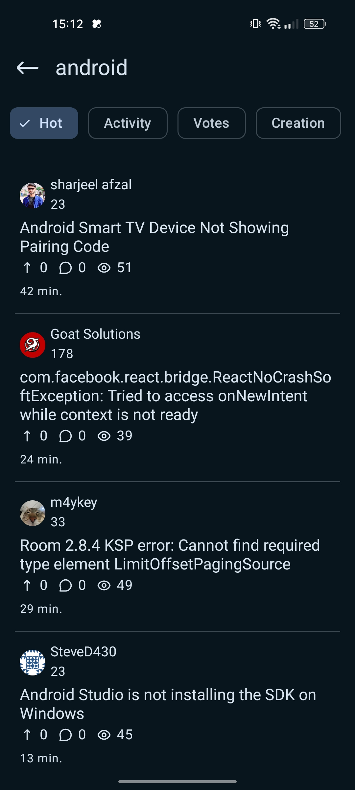
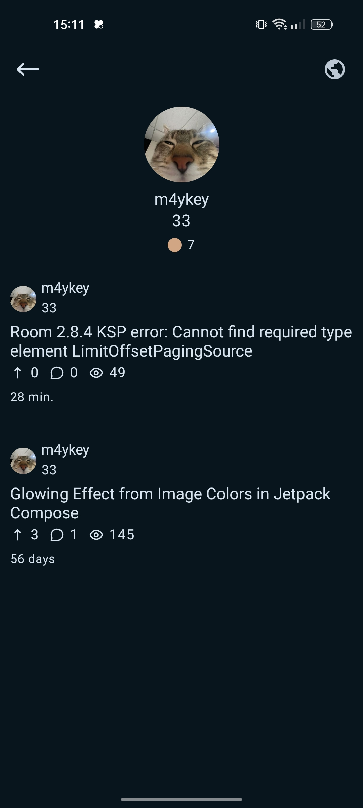

# Stos

Stos to cross-platformowa aplikacja (Android/PC) zbudowana przy użyciu **Compose Multiplatform**, zaprojektowana
do przeglądania  [StackExchange](https://api.stackexchange.com/docs) i [StackOverflow](https://stackoverflow.com/)

## Dlaczego Stos?
Stos został zbudowany z intencją do nauki Compose Multiplatform. Chciałem zrobić aplikację, która będzie poręczna
gdy ma się problem.

## Zdjęcia
|  |  |
|  |  |
|  |

## Cechy
- Proste i minimalne UI skupiony na czytelności.
- Wsparcie Cross-platformowe (aktualnie skupione na Android, PC jest w planie)
- Wyszukiwanie z filtrami - zaawansowane wyszukiwanie, aby znaleźć dokładnie te odpowiedzi, których potrzebujesz
- Podświetlanie składni i sformatowane fragmenty kodu dla lepszej czytelności

## Użyta technologia
- **Język:** [Kotlin](https://kotlinlang.org/)
- **Komponenty UI:** - [Compose Multiplatform](https://www.jetbrains.com/compose-multiplatform/)
    - [Compottie](https://github.com/alexzhirkevich/compottie) (Animacje lottie dla Compose Multiplatform)
    - [Multiplatform Markdown Renderer](https://github.com/mikepenz/multiplatform-markdown-renderer) (z Material3 i Coil3)
- **Internet:** [Ktor](https://ktor.io/) (z Content Negotiation, Logging, i silnikami multi-platform jak OkHttp, Darwin i CIO)
- **Zarządzanie danymi:**
    - [Ksoup](https://github.com/MohamedRejeb/Ksoup) (Parsowanie HTML)
    - [AndroidX Paging](https://developer.android.com/jetpack/androidx/releases/paging?hl=en) (Common, Compose, i Runtime)
- **Serializacja:** [Kotlinx Serialization](https://github.com/Kotlin/kotlinx.serialization) (JSON)
- **Ładowanie obrazów:** [Coil](https://github.com/coil-kt/coil)

## Pobierz
Obecnie możesz pobrać najnowsze APK z [Releases](https://github.com/m4ykey/Stos/releases) i zainstalować ją na swoim urządzeniu.

## Ustawienie projektu
1. Sklonuj repozytorium i otwórz je w najnowszej wersji Android Studio
2. Stwórz plik ```local.properties```
3. Dodaj klucz [StackExchange](https://api.stackexchange.com/docs)
```
k=YOUR_STACK_EXCHANGE_KEY
```

## Inspiracja
Ta aplikacja jest zainspirowana przez [Stack](https://github.com/tylerbwong/stack)

# Licencja
```
Copyright (C) 2025 Michał F

This program is free software: you can redistribute it and/or modify
it under the terms of the GNU General Public License as published by
the Free Software Foundation, either version 3 of the License, or
(at your option) any later version.

This program is distributed in the hope that it will be useful,
but WITHOUT ANY WARRANTY; without even the implied warranty of
MERCHANTABILITY or FITNESS FOR A PARTICULAR PURPOSE.  See the
GNU General Public License for more details.

You should have received a copy of the GNU General Public License
along with this program.  If not, see <https://www.gnu.org/licenses/>.
```